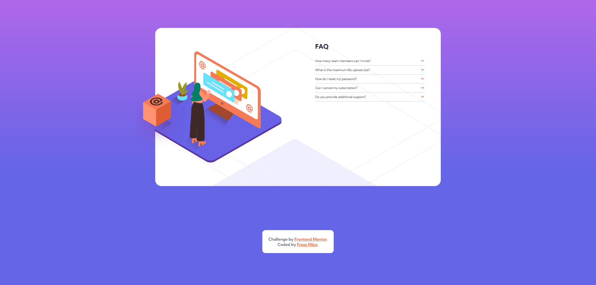

# Mike's FAQ section 

## Table of contents

- [Overview](#overview)
  - [The challenge](#the-challenge)
  - [Screenshot](#screenshot)
  - [Links](#links)
- [My process](#my-process)
  - [Built with](#built-with)
  - [What I learned](#what-i-learned)
  - [Continued development](#continued-development)
  - [Useful resources](#useful-resources)
- [Author](#author)
- [Acknowledgments](#acknowledgments)

## Overview

### The project

My challenge is to build out this FAQ accordion card and get it looking as close to the design as possible.

The users should be able to:

- View the optimal layout for the component depending on their device's screen size
- See hover states for all interactive elements on the page
- Hide/Show the answer to a question when the question is clicked
- **Bonus**: Complete the challenge without using JavaScript

The design: 

### Screenshot

My solution:

### Links

- [Solution URL](https://github.com/mikeFrees/faq-accordion-card-main.git)
- [Live Site URL](https://mikes-faq-section.netlify.app/)

## My process

### Built with

- Semantic HTML5 markup
- CSS custom properties
- Flexbox
- javascript
- scss with 7 - 1 file structure

### What I learned

- how to use npm renamer and copyfiles
- the beginning of how RegEx works
- how to use the deyails and summary tag in HTML

### Continued development

### Useful resources

- 

## Author

- LinkedIn - [Frees Mike](https://www.linkedin.com/in/mike-frees/)
- Frontend Mentor Profile - [Mike Frees](https://www.frontendmentor.io/profile/mikeFrees)